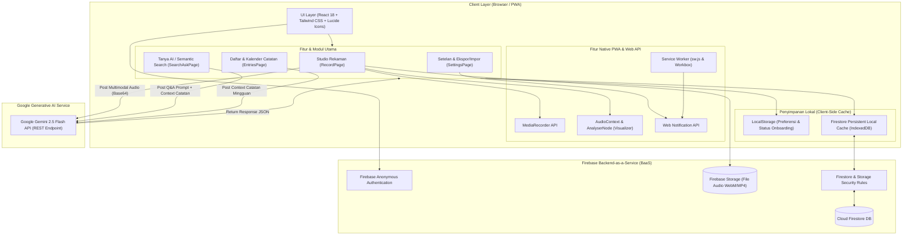
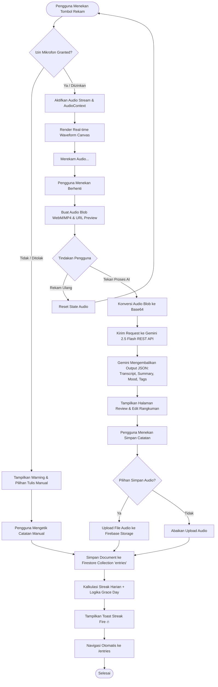
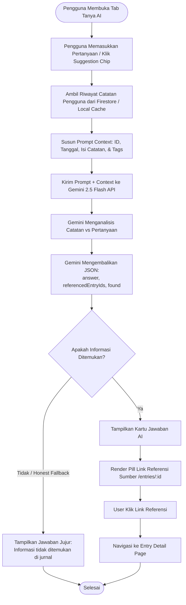
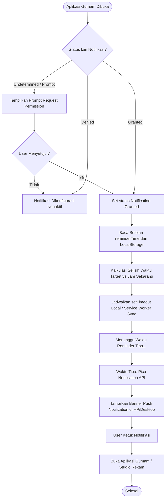

# 📐 Diagram Arsitektur & Alur Kerja Sistem — Gumam PWA

> **Aplikasi:** Gumam (Voice Journaling PWA Berbasis AI)  
> **Kompetisi:** BitsMikro Innovative VibeCode 2026  
> **Tim Pengembang:** Tim Calon Manajer Kopdes  

Dokumen ini berisi kode **Mermaid** resmi untuk **Arsitektur Sistem** dan **Alur Kerja Sistem** aplikasi Gumam.

---

## 🏗️ 1. Diagram Arsitektur Sistem (System Architecture)

Diagram berikut menggambarkan komponen-komponent utama arsitektur aplikasi **Gumam**, mulai dari *Client Layer (PWA)*, *Local Storage & Cache*, *Firebase BaaS*, hingga *Google Gemini AI Service*.

---

## 🔄 2. Diagram Alur Kerja Sistem (System Workflows)

### 🎙️ A. Alur Kerja Rekam Suara & Pengolahan AI Gemini (Voice Processing Pipeline)

Alur berikut menjelaskan tahapan pengguna mengambil rekaman suara hingga diproses oleh **Gemini 2.5 Flash API** dan disimpan ke **Firestore & Firebase Storage**.

---

### 🔍 B. Alur Kerja AI Tanya Jurnal (Semantic Natural Language Search / RAG)

Alur berikut menjelaskan alur pencarian memori natural language (*Retrieval-Augmented Generation / RAG*) di mana AI mencari jawaban dari catatan pengguna tanpa mengarang fakta.

---

### 🔔 C. Alur Kerja Penjadwalan Reminder Notifikasi PWA

Alur berikut menjelaskan bagaimana pengingat lokal dijadwalkan dan dipicu oleh **Service Worker** & **Web Notification API**.

---

## 📌 Kesimpulan Arsitektur

Arsitektur aplikasi **Gumam** mengusung prinsip **Hybrid Progressive Web App (PWA)**:
1. **Client-Side Heavy**: Seluruh UI, perekaman audio, visualisasi gelombang suara, dan komunikasi API berjalan langsung di browser pengguna.
2. **Serverless BaaS**: Menggunakan Firebase untuk autentikasi anonim, Firestore dengan *offline persistence*, dan Firebase Storage.
3. **Multimodal AI Integration**: Memanfaatkan keunggulan Google Gemini 2.5 Flash API yang mampu membaca berkas audio mentah dan memproses teks secara cepat & hemat energi.

---
*Dokumen ini dibuat oleh Tim Calon Manajer Kopdes untuk Kompetisi BitsMikro Innovative VibeCode 2026.*
